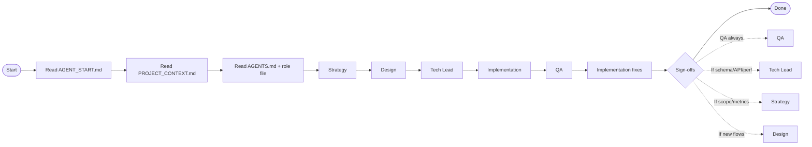

# WORKFLOW_DIAGRAM.md

Single-view workflow for DAB agents. Read AGENT_START.md first.

## Simple view (ASCII)

```
[Start]
   |
   v
[Read AGENT_START.md]
   |
   v
[Read PROJECT_CONTEXT.md]
   |
   v
[Read AGENTS.md + role file]
   |
   v
[Strategy] --> [Design] --> [Tech Lead] --> [Implementation] --> [QA]
                                                        |
                                                        v
                                               [Implementation fixes]
                                                        |
                                                        v
                                                   [Sign-offs]
                                                        |
                                                        v
                                                     [Done]

Sign-offs (if applicable):
- QA: always required
- Tech Lead: schema/API/performance changes
- Strategy: scope or metrics changes
- Design: new or revised user flows
```

## Mermaid view (optional)


